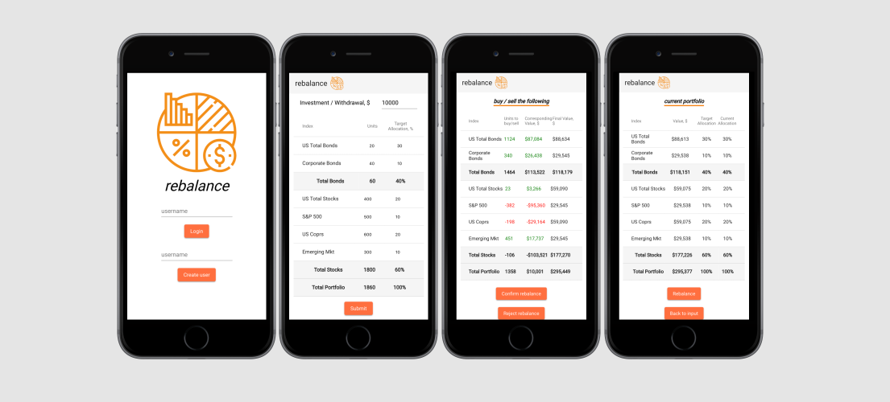

# Rebalance
Rebalance is an app to reblance investment portfolio between bonds and stocks index funds.

## Screenshots


## Getting started

### Prerequisites
- Node
- NPM
- MongoDB

1. Clone the repo
```
$ git clone https://github.com/chinins/rebalance.git
```
2. Install dependecies on the server side
```
$ cd server
$ npm install
```
3. Start MongoDb
```
$ mongod
```
4. Start the server
```
$ node index.js
```
5. Install dependencies on the client side
```
$ cd ../client
$ npm i
```
6. Run it
```
$ ng serve --open
```

## Tech Stack
- [Angular](https://angular.io/) - frontend framework
- [Koa](https://koajs.com/) - web framework for node.js
- [MongoDB](https://www.mongodb.com/) - document-oriented database program

## Author
- Olga Chinina - [Github](https://github.com/chinins)

## Contributing

Contributions Welcome! This is an on-going project and external input and ideas will be gladly recieved!

## License
This project is licensed under the MIT License, take it, have fun.
